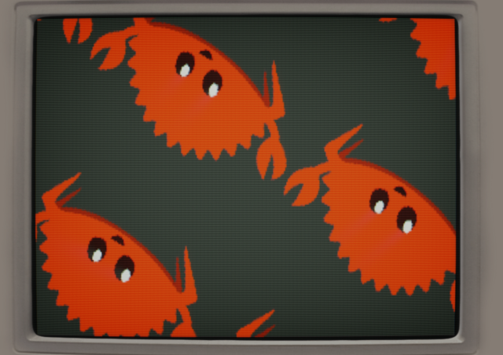

# `dos-like` for Rust &emsp; [](https://crates.io/crates/dos-like) [](https://docs.rs/dos-like) [](https://github.com/Enet4/dos-like-rs/actions/workflows/ci.yml) [](https://deps.rs/repo/github/Enet4/dos-like-rs)

This project provides access to [Mattias Gustavsson's `dos-like` framework][1],
so as to write DOS-like applications in Rust.



[1]: https://github.com/mattiasgustavsson/dos-like

## How to use

**This crate is not a regular library.**
It defines a main function on its own.
For the executable linking to work correctly,
the main source file needs to declare no `main`
and define an extern C function `dosmain` instead.

```rust
#![no_main]

#[no_mangle]
pub extern "C" fn dosmain() -> i32 {
    // your code here

    0
}
```

A utility macro is available as an alternative to declaring the function:

```rust
#![no_main]

dos_like_rs::dos_main! {
    // your code here
}
```

See the [examples](examples) for a typical application structure,
which are based on the original `dos-like` examples.

A C compiler needs to be available (uses [`cc`](https://crates.io/crates/cc)).
The dos-like framework is statically linked,
just like in a C program.

Since the initiator is based on routines in C,
this also means that panic unwinding will not work,
so it is best to configure your project to abort on [panic].
In your Cargo.toml:

```toml
[profile.dev]
panic = "abort"

[profile.release]
panic = "abort"
```

[panic]: https://doc.rust-lang.org/cargo/reference/profiles.html#panic

Check out the [`dos-like` README][2] for additional requirements.

[2]: https://github.com/mattiasgustavsson/dos-like#readme

### Cargo features

- `disable-screen-frame` compiles `dos-like` so that
the CRT screen frame around the viewport does not appear.

## Platform support

These bindings have been tested on Linux and Windows.
WebAssembly and Mac OS support is currently not guaranteed
(but your assistance on this would be greatly appreciated!).

## Building

When working on this project,
ensure that the git submodule in `dos-like-sys/dos-like` was populated
(either by cloning with `--recurse-submodules`
or by calling `git submodule update --init`).
Some of the examples do not work unless with this submodule checked out.

## License and attribution notice

The Rust bindings are licensed under either of

- Apache License, Version 2.0, ([LICENSE-APACHE](LICENSE-APACHE) or <http://www.apache.org/licenses/LICENSE-2.0>)
- MIT license ([LICENSE-MIT](LICENSE-MIT) or <http://opensource.org/licenses/MIT>)

at your option.

Unless you explicitly state otherwise, any contribution intentionally submitted
for inclusion in the work by you, as defined in the Apache-2.0 license, shall be dual licensed as above, without any
additional terms or conditions.

The `dos-like` framework remains licensed
as defined in the original [LICENSE file](dos-like-sys/dos-like/LICENSE).
